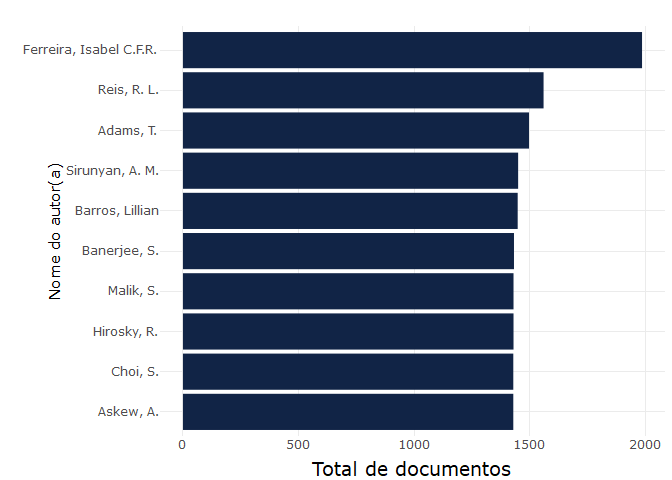

## Indicadores oasisbr - Documentação R-Shiny App

1.  Acesso à API e download de arquivo com indicadores
2.  Análise exploratória dos dados
3.  Instalação de servidores RStudio e RShiny
4.  Aplicação R-Shiny

## Download de arquivos com informações sobre os indicadores

Os indicadores da oasisbr são disponibilizados via api. Mais informações
sobre a api: `https://oasisbr.ibict.br/vufind/api/v1/`

``` r
oasisbrAPILink <- "https://oasisbr.ibict.br/vufind/api/v1/search?&type=AllFields&page=0&limit=0&sort=relevance&facet[]=author_facet&facet[]=dc.subject.por.fl_str_mv&facet[]=eu_rights_str_mv&facet[]=dc.publisher.program.fl_str_mv&facet[]=dc.subject.cnpq.fl_str_mv&facet[]=publishDate&facet[]=language&facet[]=format&facet[]=institution&facet[]=dc.contributor.advisor1.fl_str_mv"
```

É feito o download do arquivo em formato `JSON` via pacote `jsolinte`,
utilizando-se a função `fromJSON`.

``` r
library(jsonlite)
oasisbrDF <- fromJSON(oasisbrAPILink)
```

------------------------------------------------------------------------

O arquivo possui a seguinte estrutura:

``` r
names(oasisbrDF)
```

    ## [1] "resultCount" "facets"      "status"

------------------------------------------------------------------------

Dentro da lista `resultCount`, encontra-se **quantidade de documentos**
recuperados:

``` r
oasisbrDF$resultCount
```

    ## [1] 2758152

------------------------------------------------------------------------

Dentro da lista `facets`, encontram-se **dez listas para dez variáveis
diferentes**:

``` r
names(oasisbrDF$facets)
```

    ##  [1] "author_facet"                      "dc.subject.por.fl_str_mv"         
    ##  [3] "eu_rights_str_mv"                  "dc.publisher.program.fl_str_mv"   
    ##  [5] "dc.subject.cnpq.fl_str_mv"         "publishDate"                      
    ##  [7] "language"                          "format"                           
    ##  [9] "institution"                       "dc.contributor.advisor1.fl_str_mv"

As informações sobre as variáveis se encontram no documento
`Padrão de Metadados da BDTD - MTD3-BR v.2017.pdf`

Todas as listas possuem **4 colunas**:

``` r
#Exemplo: author_facet
names(oasisbrDF$facets$author_facet)
```

    ## [1] "value"      "translated" "count"      "href"

A coluna `value` representa o valor, `translated` o valor traduzido,
`count` a frequência e `href` o hyperlink.

``` r
head(oasisbrDF$facets$author_facet)
```

    ##                             value                      translated count
    ## 1         Ferreira, Isabel C.F.R.         Ferreira, Isabel C.F.R.  1974
    ## 2                     Reis, R. L.                     Reis, R. L.  1545
    ## 3                 Barros, Lillian                 Barros, Lillian  1430
    ## 4                 Teixeira, J. A.                 Teixeira, J. A.  1400
    ## 5                 Sirunyan, A. M.                 Sirunyan, A. M.  1187
    ## 6 Instituto de Engenharia Nuclear Instituto de Engenharia Nuclear  1102
    ##                                                                                        href
    ## 1       ?limit=0&type=AllFields&filter%5B%5D=author_facet%3A%22Ferreira%2C+Isabel+C.F.R.%22
    ## 2                   ?limit=0&type=AllFields&filter%5B%5D=author_facet%3A%22Reis%2C+R.+L.%22
    ## 3               ?limit=0&type=AllFields&filter%5B%5D=author_facet%3A%22Barros%2C+Lillian%22
    ## 4               ?limit=0&type=AllFields&filter%5B%5D=author_facet%3A%22Teixeira%2C+J.+A.%22
    ## 5               ?limit=0&type=AllFields&filter%5B%5D=author_facet%3A%22Sirunyan%2C+A.+M.%22
    ## 6 ?limit=0&type=AllFields&filter%5B%5D=author_facet%3A%22Instituto+de+Engenharia+Nuclear%22

------------------------------------------------------------------------

Dentro da lista `status`, é exiba uma mensagem sobre o **status** do
`JSON`.

``` r
oasisbrDF$status
```

    ## [1] "OK"

------------------------------------------------------------------------

## R-Shiny app

O aplicativo desenvolvido tem o intuito de disponibilizar a visualização
dos indicadores, de maneira interativa. Os scripts estão armazenados no
arquivo `app.R`. Após finalizado, é necessário disponibilizar a
aplicação.

------------------------------------------------------------------------

## Configurando o servidor

Algumas etapas são necessárias para configurar o servidor.

### Instalar o R

Antes de instalar o servidor Shiny, precisamos instalar o R.

`sudo apt-get install r-base`

------------------------------------------------------------------------

### Instalar o RStudio-server

A instalação de um servidor Rstudio também é importante para
verificações dos scripts dentro do próprio servidor
`sudo gdebi rstudio-server-2021.09.1-372-amd64.deb`

------------------------------------------------------------------------

### Instalar o R-Shiny server

A instalação do Shiny-server é feita com a ferramenta `GDebi`. Para sua
instalação, basta usar o seguinte comando:

`sudo apt-get install gdebi-core`

Para fazer o download do Shiny-server, basta usar o seguinte comando
(lembrar de buscar por versão mais atualizada):

`Wget https://download3.rstudio.org/ubuntu-12.04/x86_64/shiny-server-1.4.2.786-amd64.deb`

Agora, basta usar o `GDebi` para instalar o arquivo que foi baixado,
utilizando o seguinte comando:

`sudo gdebi shiny-server-1.4.2.786-amd64.deb`

------------------------------------------------------------------------

### Instalar o pacote libxml2-dev

`sudo apt-get update -y` `sudo apt-get install -y libxml2-dev`

------------------------------------------------------------------------

### Instalar o pacote libcurl4-openssl-dev

`sudo apt-get update` `sudo apt-get install libcurl4-openssl-dev`

------------------------------------------------------------------------

## Acesso aos ambientes

### Rstudio server

O Rstudio server é disponibilizado na porta `8787`.

------------------------------------------------------------------------

### R-Shiny server

O R-Shiny server é disponibilizado na porta `3838`.

------------------------------------------------------------------------

### Pasta com aplicativos

As aplicações se encontram na pasta `/srv/shiny-server/`

------------------------------------------------------------------------

### Pasta com logs de erros

Todas os logs contendo mensagens de erros e informações sobre problemas
na execução das aplicações, se sencontram na seguinte pasta:
`/var/log/shiny-server/`

------------------------------------------------------------------------

# Visualização dos indicadores

------------------------------------------------------------------------

## Autor `author_facet`

``` r
library(ggplot2)
library(scales)
library(plotly)

author_facet <- oasisbrDF$facets$author_facet

## Ordena coluna 'count'
author_facet <- author_facet[with(author_facet, order(-count)),]

## Retira registro 'sem informação' da coluna 'value'
author_facet <- author_facet[author_facet$value!='sem informação',]

## Seleciona top 10
author_facet <- head(author_facet, n=10)

## Gráfico de top 10 Autore(a)s

authorPlot <- ggplot(author_facet) +
  aes(x = reorder(value, count), group = value, weight = count, 
      text=paste("Autor(a):",value,"<br>","Quantidade",comma(count))) +
  geom_bar(fill = "#112446") +
  labs(x = "Nome do autor(a)", 
       y = "Total de documentos", title = NULL) +
  theme_minimal() +
  theme(axis.title.x = element_text(size = 14L)) +
  coord_flip()

ggplotly(authorPlot, tooltip="text")
```


