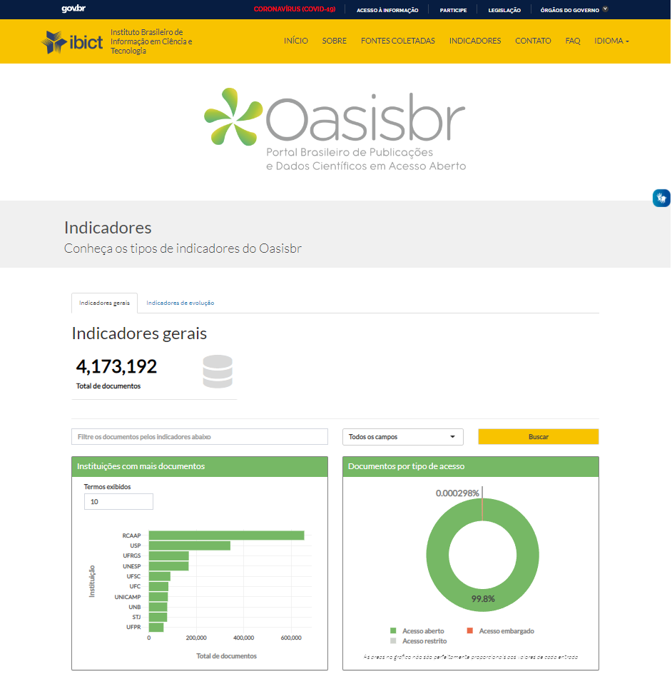
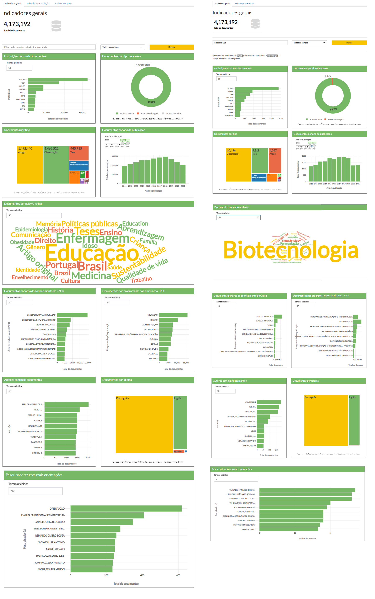
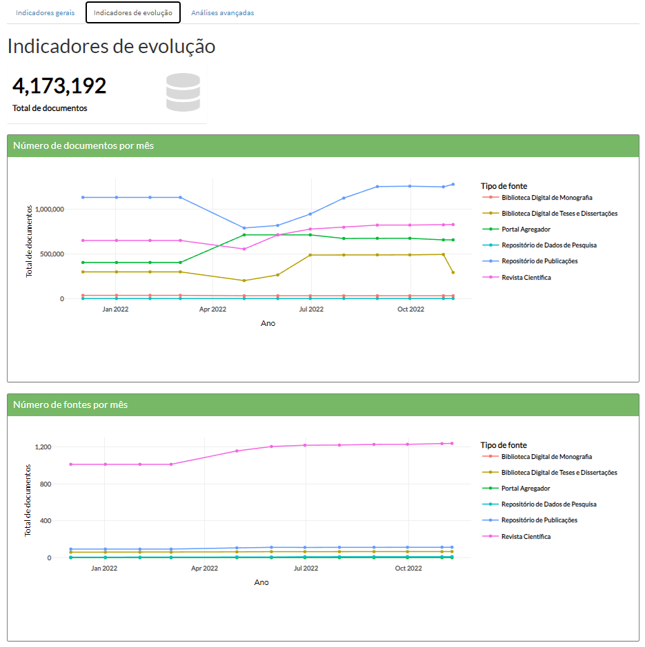
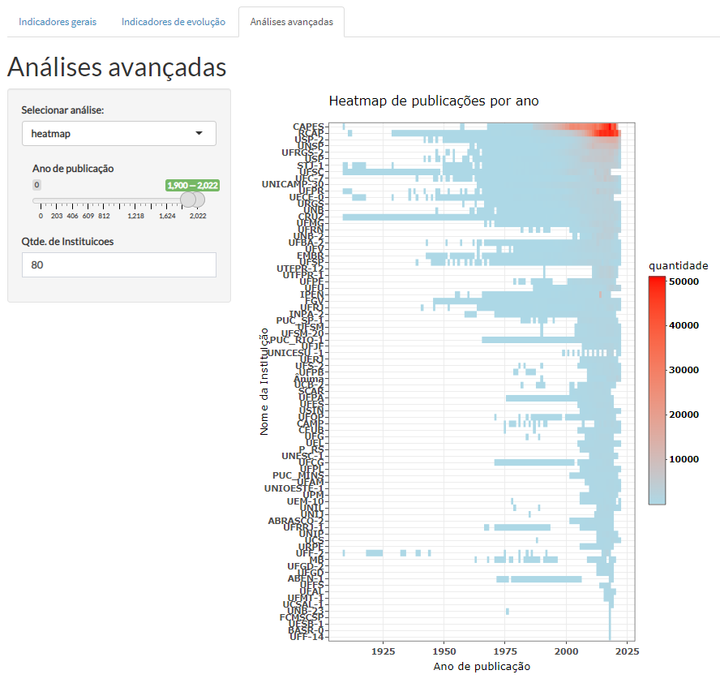

# 

## Indicadores oasisbr

### Documentação R-Shiny app

## Indicadores oasisbr - Documentação R-Shiny App

1.  Acesso à API e download de arquivo com indicadores
2.  Análise exploratória dos dados
3.  Instalação de servidores RStudio e RShiny
4.  Aplicação R-Shiny

## Download de arquivos com informações sobre os indicadores

1.  Os indicadores da oasisbr são disponibilizados via api.  

``` r
oasisbrAPILink <- "https://oasisbr.ibict.br/vufind/api/v1/search?&type=AllFields&page=0&limit=0&sort=relevance&facet[]=author_facet&facet[]=dc.subject.por.fl_str_mv&facet[]=eu_rights_str_mv&facet[]=dc.publisher.program.fl_str_mv&facet[]=dc.subject.cnpq.fl_str_mv&facet[]=publishDate&facet[]=language&facet[]=format&facet[]=institution&facet[]=dc.contributor.advisor1.fl_str_mv"
```

------------------------------------------------------------------------

## Indicadores de evolução:

<https://api-oasisbr.ibict.br/api/v1/evolution-indicators?init=10/10/2017&end=10/10/2021>

------------------------------------------------------------------------

## Documentação indicadores de evolução:

<https://api-oasisbr.ibict.br/api/v1/doc/#/default/EvolutionIndicatorsController_find>

------------------------------------------------------------------------

Mais informações sobre a api:  
<https://oasisbr.ibict.br/vufind/api/v1/>  
Mais informações sobre `facets`:  
[Apache Solr Reference Guide 6.6 -
Faceting](%60https://solr.apache.org/guide/6_6/faceting.html%60)

É feito o download do arquivo em formato `JSON` via pacote `jsolinte`,
utilizando-se a função `fromJSON`.

``` r
library(jsonlite)
oasisbrDF <- fromJSON(oasisbrAPILink)
```

------------------------------------------------------------------------

O arquivo possui a seguinte estrutura:

``` r
names(oasisbrDF)
```

    ## [1] "resultCount" "facets"      "status"

------------------------------------------------------------------------

Dentro da lista `resultCount`, encontra-se **quantidade de documentos**
recuperados:

``` r
oasisbrDF$resultCount
```

    ## [1] 3010384

------------------------------------------------------------------------

Dentro da lista `facets`, encontram-se **dez listas para dez variáveis
diferentes**:

``` r
names(oasisbrDF$facets)
```

    ##  [1] "author_facet"                      "dc.subject.por.fl_str_mv"         
    ##  [3] "eu_rights_str_mv"                  "dc.publisher.program.fl_str_mv"   
    ##  [5] "dc.subject.cnpq.fl_str_mv"         "publishDate"                      
    ##  [7] "language"                          "format"                           
    ##  [9] "institution"                       "dc.contributor.advisor1.fl_str_mv"

As informações sobre as variáveis se encontram no documento
`Padrão de Metadados da BDTD - MTD3-BR v.2017.pdf`

Todas as listas possuem **4 colunas**:

``` r
#Exemplo: author_facet
names(oasisbrDF$facets$author_facet)
```

    ## [1] "value"      "translated" "count"      "href"

A coluna `value` representa o valor, `translated` o valor traduzido,
`count` a frequência e `href` o hyperlink.

``` r
head(oasisbrDF$facets$author_facet)
```

    ##                     value              translated count
    ## 1 Ferreira, Isabel C.F.R. Ferreira, Isabel C.F.R.  1986
    ## 2             Reis, R. L.             Reis, R. L.  1560
    ## 3               Adams, T.               Adams, T.  1497
    ## 4         Sirunyan, A. M.         Sirunyan, A. M.  1450
    ## 5         Barros, Lillian         Barros, Lillian  1448
    ## 6            Banerjee, S.            Banerjee, S.  1432
    ##                                                                                  href
    ## 1 ?limit=0&type=AllFields&filter%5B%5D=author_facet%3A%22Ferreira%2C+Isabel+C.F.R.%22
    ## 2             ?limit=0&type=AllFields&filter%5B%5D=author_facet%3A%22Reis%2C+R.+L.%22
    ## 3               ?limit=0&type=AllFields&filter%5B%5D=author_facet%3A%22Adams%2C+T.%22
    ## 4         ?limit=0&type=AllFields&filter%5B%5D=author_facet%3A%22Sirunyan%2C+A.+M.%22
    ## 5         ?limit=0&type=AllFields&filter%5B%5D=author_facet%3A%22Barros%2C+Lillian%22
    ## 6            ?limit=0&type=AllFields&filter%5B%5D=author_facet%3A%22Banerjee%2C+S.%22

------------------------------------------------------------------------

Dentro da lista `status`, é exiba uma mensagem sobre o **status** do
`JSON`.

``` r
oasisbrDF$status
```

    ## [1] "OK"

------------------------------------------------------------------------

## R-Shiny app

O aplicativo desenvolvido tem o intuito de disponibilizar a visualização
dos indicadores, de maneira interativa. Os scripts estão armazenados no
arquivo `app.R`. Após finalizado, é necessário disponibilizar a
aplicação.

------------------------------------------------------------------------

## Configurando o servidor

Algumas etapas são necessárias para configurar o servidor.

### Instalar o R

Antes de instalar o servidor Shiny, precisamos instalar o R.

`sudo apt-get install r-base`

------------------------------------------------------------------------

### Instalar o RStudio-server

A instalação de um servidor Rstudio também é importante para
verificações dos scripts dentro do próprio servidor
`sudo gdebi rstudio-server-2021.09.1-372-amd64.deb`

------------------------------------------------------------------------

### Instalar o R-Shiny server

A instalação do Shiny-server é feita com a ferramenta `GDebi`. Para sua
instalação, basta usar o seguinte comando:

`sudo apt-get install gdebi-core`

Para fazer o download do Shiny-server, basta usar o seguinte comando
(lembrar de buscar por versão mais atualizada):

`Wget https://download3.rstudio.org/ubuntu-12.04/x86_64/shiny-server-1.4.2.786-amd64.deb`

Agora, basta usar o `GDebi` para instalar o arquivo que foi baixado,
utilizando o seguinte comando:

`sudo gdebi shiny-server-1.4.2.786-amd64.deb`

------------------------------------------------------------------------

### Instalar o pacote libxml2-dev

`sudo apt-get update -y` `sudo apt-get install -y libxml2-dev`

------------------------------------------------------------------------

### Instalar o pacote libcurl4-openssl-dev

`sudo apt-get update` `sudo apt-get install libcurl4-openssl-dev`

------------------------------------------------------------------------

## Acesso aos ambientes

### Rstudio server

O Rstudio server é disponibilizado na porta `8787`.

------------------------------------------------------------------------

### R-Shiny server

O R-Shiny server é disponibilizado na porta `3838`.

------------------------------------------------------------------------

### Iniciando e parando o servidor

Para iniciar ou parar servidor, basta usar os seguintes comando:  
`sudo systemctl start shiny-server` `sudo systemctl stop shiny-server`

Também é possível reiniciar o servidor, usando:

`sudo systemctl restart shiny-server`

### Pasta com aplicativos

As aplicações se encontram na pasta `/srv/shiny-server/`

------------------------------------------------------------------------

### Pasta com logs de erros

Todas os logs contendo mensagens de erros e informações sobre problemas
na execução das aplicações, se sencontram na seguinte pasta:
`/var/log/shiny-server/`

------------------------------------------------------------------------

# Visualização dos indicadores

------------------------------------------------------------------------

## Autor `author_facet`

``` r
library(ggplot2)
library(scales)
library(plotly)

author_facet <- oasisbrDF$facets$author_facet

## Ordena coluna 'count'
author_facet <- author_facet[with(author_facet, order(-count)),]

## Retira registro 'sem informação' da coluna 'value'
author_facet <- author_facet[author_facet$value!='sem informação',]

## Seleciona top 10
author_facet <- head(author_facet, n=10)

## Gráfico de top 10 Autore(a)s

authorPlot <- ggplot(author_facet) +
  aes(x = reorder(value, count), group = value, weight = count, 
      text=paste("Autor(a):",value,"<br>","Quantidade",comma(count))) +
  geom_bar(fill = "#112446") +
  labs(x = "Nome do autor(a)", 
       y = "Total de documentos", title = NULL) +
  theme_minimal() +
  theme(axis.title.x = element_text(size = 14L)) +
  coord_flip()

ggplotly(authorPlot, tooltip="text")
```


------------------------------------------------------------------------

# Aplicação R-Shiny - Oasisbr 

------------------------------------------------------------------------

O principal objetivo da aplicação é exibir visualizações e indicadores gerais sobre a base de dados do Oasisbr, além da possibilidade de análises avançadas.

## Estrutura do app
A aplicação pode ser separada em duas partes:

`ui`: user side
`server`: server side

Dentro da `ui` se encontra a interface do usuário para o app, e o `server` possui os comandos para gerar os outputs, que são visualizados no user side, podendo interagir com valores de `inputs` fornecidos/selecionados pelo usuário.

A estruturação da `ui` foi feita utilizando a função `tabsetPanel()`, que permite dividir em abas o conteúdo das `ui`'s. Neste caso, foram criadas três abas: Indicadores gerais, Indicadores de evolução e Análises avançadas.

# 

## Função para download de busca feita pelo usuario

Para a consulta dessas informações, feita via API, foi criada uma função `busca_oasisbr()`, em R, que parametriza a api e faz as solicitações de acordo com o `input` do usuário. A busca resulta em um arquivo no formato `JSON`.

``` r
busca_oasisbr <- function(url="http://localhost/vufind/api/v1/search?",
                          lookfor,
                          type="AllFields",
                          sort="relevance",
                          facet_parameters="&facet[]=author_facet&facet[]=dc.subject.por.fl_str_mv&facet[]=eu_rights_str_mv&facet[]=dc.publisher.program.fl_str_mv&facet[]=dc.subject.cnpq.fl_str_mv&facet[]=publishDate&facet[]=language&facet[]=format&facet[]=institution&facet[]=dc.contributor.advisor1.fl_str_mv")
                          
  {
  
  query <- paste(url,"lookfor=",URLencode(lookfor),"&type=",type,"&sort=",sort,facet_parameters,sep="")
  
  x <- fromJSON(query)
  
  return(x)
}

```

Neste caso, os inputs utilizados são o termo de busca, utilizado na função como o parâmetro `lookfor`, e o campo, `type`, no qual deve ser feita essa busca. Outros parâmetros também são utilizados, como `sort`, que pode ser usado para ordenar o resultado da busca, e o `facet_parameters`, onde são declarados os campos escolhidos a serem visualizados.

### Dataframe reativo

Ao início da aplicação, é criado um dataframe reativo, utilizando a função `reactive()`. O objeto reativo `oasisbrBuscaUser()` é criado a partir da função de busca `busca_oasisbr()` previamente mencionada, com o argumento `lookfor = ""`, em branco, por se tratar da busca padrão dentro da base.

```
  oasisbrBuscaUser <<- reactive({

    oasisbrDF <- busca_oasisbr(lookfor = "")

    return(oasisbrDF)

  })

```

Após o carregamento dá aplicação, o usuário pode realizar pesquisas dentro da base.
O input para o texto inserido na barra de busca, definido na `ui` da interface, é `input$textoBuscaInput`. O botão de busca, quando ativado, realiza a consulta ao banco utilizando os inputs `textoBuscaInput` e `camposInput`, atualiza o dataframe reativo `oasisbrBuscaUser()` e atualiza os outputs dos gráficos.


```
  ## Cria DF reativo para a busca do usuário e atualiza outputs
  
  observeEvent(input$buscarButton,{
    
    print(paste("Iniciado busca para termo:",isolate(input$textoBuscaInput)))
    
    oasisbrBuscaUser <<- reactive({
      
      start <- Sys.time ()
      x <- busca_oasisbr(lookfor = URLencode(isolate(input$textoBuscaInput)),
                    type=isolate(input$camposInput))
      
      tempo_de_busca <<- (Sys.time () - start)
      return(x)
      
    })
    
    mod_graficos_server("graficos")
    
    mod_graficos_evolucao_Server("graficos_evolucao")
    
    mod_analises_avancadas_Server("analises_avancadas")
    
    })
```

### Módulos

Para facilitar a organização dos códigos fontes, e também para manter boas práticas na construção da aplicação, os códigos foram divididos em `modulos`. Cada módulo possui sua própria função para `ui` e `server`, o que facilita na implementação de grandes pedaços ou partes de código em outras aplicações. Os scripts se encontram dentro da pasta `R`.

Exemplo de trecho de código do módulo de gráficos da aba de indicadores gerais: `R/mod_graficos.R`

``` 
mod_graficos_UI <- function(id,x) {
  ns <- NS(id)
  

  tagList(
    fluidRow(
             box(
               title = "Instituições com mais documentos", width = 6, solidHeader = TRUE, status = "primary",
               column(12,numericInput(ns("instituicoesTopInput"),"Termos exibidos",min=1, max=25, 10,width="30%")),
               column(12,addSpinner(plotlyOutput(ns("instituicoesPlotlyOutput"),height="300px"),spin="folding-cube",color="green")))
  )
  )
}

mod_graficos_server <- function(id, base) {
  shiny::moduleServer(
    id,
    function(input, output, session) {
      
      output$instituicoesPlotlyOutput <- renderPlotly({render_instituicoesPlot(oasisbrBuscaUser(),input$instituicoesTopInput)})
      
      
    }
  )
}
```

### Funções para gerar gráficos

Foram criadas funções para facilitar a inserção de inputs e visualização do dados a partir deles. Os scripts se encontram dentro da pasta `plots`. A função possui normalmente dois ou mais argumentos, sendo o primeiro deles o dataframe reativo `oasisbrBuscaUser()`, e os outros `inputs` do usuário para filtrar esse objeto. Além disso, a função realiza manipulações no dataframe, além de criar validações para o caso de erros ou outputs não desejados. Os gráficos foram construídos inicialmente utilizando o pacote `ggplot2`, e, posteriormente, o pacote `plotly`, pois este permite maior flexibilidade e interação do usuário diretamente com o gráfico.

Abaixo, o exemplo da função que retorna a visualização de dados referentes às instituições presentes na base do Oasisbr.

```
  render_instituicoesPlot <- function(x,y) {
  
  ## Validação para busca sem registros
  shiny::validate(need(x$resultCount>0, paste("A sua busca não corresponde a nenhum registro.")))  
  
  instituicoes_facet <- x$facets$institution
  #author_facet
  
  ## Validação para informação vazia.
  shiny::validate(need(is.null(instituicoes_facet)==FALSE, paste("Não existem informações sobre esse(s) registro(s).")))
  
  
  ## Validação para número de termos exibidos
  shiny::validate(need((y>0 & y<=25), paste("O número de termo exibidos precisa estar entre 0 e 25.")))
  
  
  ## Ordena coluna 'count'
  instituicoes_facet <- instituicoes_facet[with(instituicoes_facet, order(-count)),]
  
  ## Retira registro 'sem informação' da coluna 'value'
  instituicoes_facet <- instituicoes_facet[instituicoes_facet$value!='sem informação',]
  
  ## Adiciona % do total
  instituicoes_facet <- instituicoes_facet %>% mutate(pctTotal=count/x$resultCount)
  
  ## Seleciona top 10
  instituicoes_facet <- head(instituicoes_facet, n=y)
  
  instituicoes_facet$color <- "#76B865"
  
  
  ## Gráfico de top 10 Autore(a)s
  
  instituicoesPlot <- ggplot(instituicoes_facet) +
    aes(x = reorder(value, count), group = value, weight = count, 
        text=paste('<b style="font-family: Lato !important; align=left; font-size:14px; font-weight:400; color:gray">Instituição:</b>',
                   '<b style="font-family: Lato !important; align=left; font-size:16px; font-weight:600 color: black">',value,"</b>",
                   "<br><br>",
                   '<b style="font-family: Lato !important; align=left; font-size:14px font-weight:400; color:gray">Total de documentos:</b>',
                   '<b style="font-family: Lato !important; align=left; font-size:16px; font-weight:600 color: black">',comma(count),"</b>",
                   "<br><br>")
    ) +
    geom_bar(fill = "#76B865") +
    
    scale_y_continuous(labels = scales::comma)+
    labs(x = "<b style='color:gray'>Instituição</b><br><br><b style='color:white'>.", 
         y = "<b style='color:gray; font-size:14px'>Total de documentos", title = NULL) +
    
    theme_minimal() +
    theme(axis.title.x = element_text(size = 14L)) +
    coord_flip()
  
  instituicoesPlot <- ggplotly(instituicoesPlot, tooltip="text")
  
  instituicoesPlot %>%
    
    layout(font=t, 
           margin = list(l=50,b = 55),
           hoverlabel=list(bgcolor="white")
    ) %>% config(displayModeBar = F) 
  
  
  
  
}
```

### Outputs
Os outputs são definidos no `server` da aplicação. Como os objetos gráficos criados foram feitos utilizando o pacote `plotly`, precisamos utilizar a função `renderPlotly({})` para renderizá-los. São declarados dentro do output a função que renderiza o gráfico em questão (neste caso, `render_instituicoesPlot()`), com o dataframe reativo `oasisbrBuscaUser()` e um input `input$instituicoesTopInput` herdado da `ui`, servindo como filtro para a visualização.

```
output$instituicoesPlotlyOutput <- renderPlotly({

render_instituicoesPlot(oasisbrBuscaUser(),input$instituicoesTopInput)

})
```

### Indicadores Gerais
Dentro da aba de indicadores gerais são exibidos nove gráficos, referentes aos campos que são recuperados pela consulta ao banco.

Ao lado esquerdo da imagem, a página inicial, e ao lado direito, os indicadores atualizados para a busca pelo termo "biotecnologia" como exemplo.
# 


### Indicadores de evolução
Os indicadores de evolução são coletados pela api disponível em: `https://api-oasisbr.ibict.br/api/v1/evolution-indicators?init=10/10/2017&end=10/10/2021`.

# 

### Análises avançadas
Abaixo, uma das análises avançadas disponíveis na máquina de testes, o heatmap da quantidade de documentos por instituições e por ano de publicação. 

# 

Outras análises avançadas estão em andamento, como a análise de redes de colaboraçãoo, visualização em mapas e disponibilização de `pivotTable` para análise livre por parte do usuário.

### Customização CSS

A aplicação também pode ser customizada, utilizando CSS. Abaixo é exibido o código utilizado para a padronização de fontes e cores do aplicativo, além de ajustes finos de layout.


